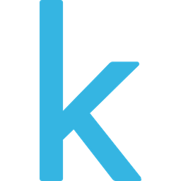

  

<h1 align="center">Hello there, I'm Malika :woman_technologist:</h1>

___________________________________________________________________

<h3 align="center"> Passionate data analyst with engineering experience, adept at visualizing insights, self-driven, curious programmer eager to solve complex real-world problems.</h3>

  
  

___________________________________________________________________

<h2 align="left">:sunglasses: Insights about me</h2>

- 🔭 I’m currently working on [News Based Sentiment Analysis for Stock Investment Project](https://www.youtube.com/watch?v=bN2dT0JLHZ8)

- 🌱 I’m currently learning [Java Programming](https://github.com/malikahafizap/malikahafizap/Java-Programming)

- 👭 I’m looking to collaborate on Data Science related projects

- 🤝 I’m looking for help with starting competitive coding

- 💬 Ask me anything about the tech-related stuff

- 🎯 Always Upskilling and becoming a better Engineer everyday

- 😄 Pronouns: She/Her/Hers

- ⚡ Fun fact: I was enamored with motor🚘racing even before I knew driving😛

___________________________________________________________________

<h2 align="left"> :mailbox:  Let's get connected</h2>

| LinkedIn | Instagram | Discord | LeetCode | HackerRank | Kaggle |
|----------|----------|----------|----------|----------|----------|
|  <a href="https://linkedin.com/in/malikahafizap" target="blank"> | <a href="https://instagram.com/in/malikahafizap" target="blank"> | <a href="https://discord.com/in/malikahafizap" target="blank"> | <a href="https://leetcode.com/in/malikahafizap" target="blank"> | <a href="https://hackerrank.com/in/malikahafizap" target="blank"> | <a href="https://kaggle.com/in/malikahafizap" target="blank"> 

___________________________________________________________________

<h2 align="left"> 💻 Languages, Technologies and Tools</h2>

| Python3 | Java | R | C | C++ | HTML5 | CSS3 | JavaScript | Solidity | GO | Pytorch | Selenium | Numpy | Pandas | Sklearn | Matplotlib | OpenCV | Conda | Jupyter | Spark | MySQL | Postgres | SQLite | nodejs | Git | Docker | Pytest | Swagger | Postman | Virtual Box| HardHat |
|----------|----------|----------|----------|----------|----------|----------|----------|----------|----------|----------|----------|----------|----------|----------|----------|----------|----------|----------|----------|----------|----------|----------|----------|----------|----------|----------|----------|----------|----------|----------|
|   |   |  | |  |  |  |  |  |   |   |   |   |   |   |   |   |  |   |  |  |  |  |  |  |  |  |  |  |  |  |

___________________________________________________________________

<h2 align="left"> :bar_chart: Overall Statistics</h2>

  

  

  

___________________________________________________________________

 

<!---
malikahafizap/malikahafizap is a ✨ special ✨ repository because its `README.md` (this file) appears on your GitHub profile.
You can click the Preview link to take a look at your changes.
--->
